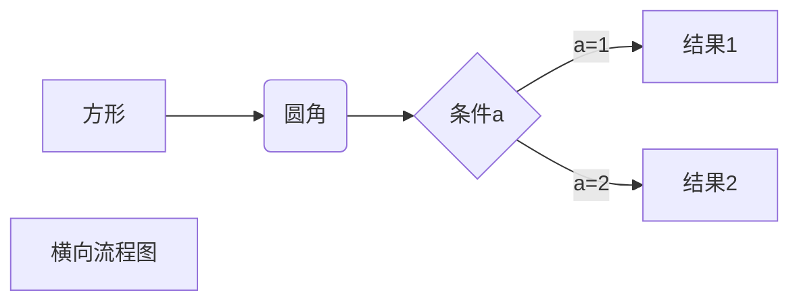

|学好|姓名|
|---|---|
|100|韦俊远|
|101|程海莹|
'pub fn treasury_imbalance(is_punish: IsPunished, vote:
	VoteInfo<T::BlockNumber, T::AccountId, T::Balance, T::Hash>) -> (TreasuryNeed, BalanceOf<T>) '   
	
1.第一个       

   - haha
   - 嘿嘿  
   * 
    
>最外层
>>第二层
>>>第三层  

***你好，世界***  
`pub fn treasury_imbalance(is_punish: IsPunished, vote: VoteInfo<T::BlockNumber, T::AccountId, T::Balance, T::Hash>) -> (TreasuryNeed, BalanceOf ) `
```rust
pub fn everyone_balance_oprate(is_punish: IsPunished,
								   vote: VoteInfo<T::BlockNumber, T::AccountId, T::Balance, T::Hash>){

		let reporter = vote.clone().reporter;
		let illegalman = vote.clone().illegal_man;
		// 真的作弊
		if is_punish == IsPunished::YES {
			// 惩罚作弊者的金额(注册过的人没有进入黑名单， 那么一定存在）
			if !<BlackList<T>>::exists(reporter.clone()) {
				if T::Currency0::total_balance(&illegalman) >= T::IllegalPunishment::get(){
					T::Currency0::slash_reserved(&illegalman, T::IllegalPunishment::get());
				}
				else{
					T::Currency0::slash_reserved(&illegalman, T::Currency0::total_balance(&illegalman));
				}

			}
			if !<BlackList<T>>::exists(reporter.clone()) {
				// 数额巨大 不需要考虑存活问题
				T::Currency0::unreserve(&reporter, T::ReportReserve::get());
				T::Currency0::deposit_creating(&reporter, T::ReportReward::get());
			}
		}
		// 虚假举报
		else {
			// 惩罚举报者的金额
			if !<BlackList<T>>::exists(reporter.clone()) {
				// 账户必须要存在
				if <system::AccountNonce<T>>::exists(reporter.clone()){
					if T::Currency0::total_balance(&reporter) >= T::ReportReserve::get(){
						T::Currency0::slash_reserved(&reporter, T::ReportReserve::get());

					}
					else{
						T::Currency0::slash_reserved(&reporter, T::Currency0::total_balance(&reporter));
					}

				}
			}
		}
		// 议员总奖励金额
		let mut all_mans =
			vote.reject_mans.iter().chain(vote.approve_mans.iter());

		for i in 0..all_mans.clone().count() {
			if let Some(peaple) = all_mans.next() {
				if !<BlackList<T>>::exists(peaple.clone()) {
					// 如果账户还存在
					if <system::AccountNonce<T>>::exists(peaple.clone()){
						// 这里代码可能冗余了  账户只要存在那么总金额肯定是大于最小存活金额的
						if T::ReportReward::get() + T::Currency0::total_balance(&peaple) >= T::Currency0::minimum_balance(){
							T::Currency0::deposit_creating(&peaple, T::CouncilReward::get());
						}
					}

						// 如果账户已经不存在
					else{
						if T::ReportReward::get() >= T::Currency0::minimum_balance(){
							T::Currency0::deposit_creating(&peaple, T::CouncilReward::get());

						}
					}

				}
			};
		}
	}  
```  
这是一个链接 [菜鸟教程](https://www.runoob.com)  



- [] -

***


1. bihai    
   * nihao
  - 哈哈哈
2. haha
